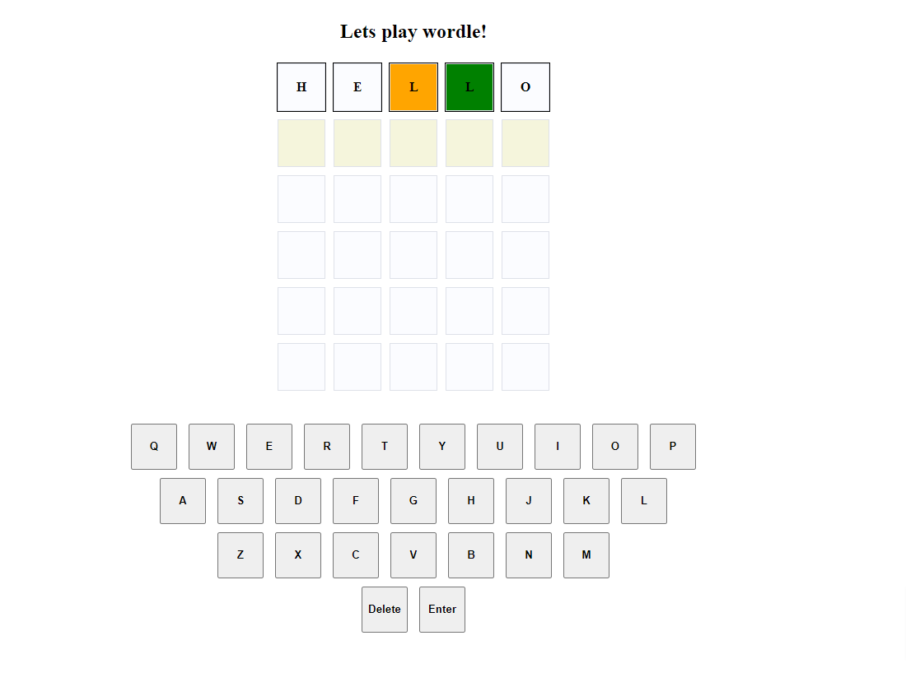

# wordle

Wordly game by Javascript# Wordle-Like Game

This project implements a simple Wordle-like game where users can guess a hidden word by entering letters and receiving feedback on their guesses. The game allows input via an on-screen keyboard or keyboard events, and it checks the validity of the guessed words against a dictionary API.

## Features

- Input letters using an on-screen keyboard or keyboard events.
- Feedback on letter positions (correct letter and correct position).
- Validates user input against a predefined list of words.
- Displays messages for user actions (e.g., too short input, word not found).
- Responsive design with basic CSS styles (not included in the code snippet).

## Demo

Try out the game live at this [Demo Link](https://toihid.github.io/wordle/).

## Image



## Installation

To run this project locally, follow these steps:

1. Clone the repository or download the source code.
   ```bash
   git clone <repository-url>
   ```
2. Install express and run as server
